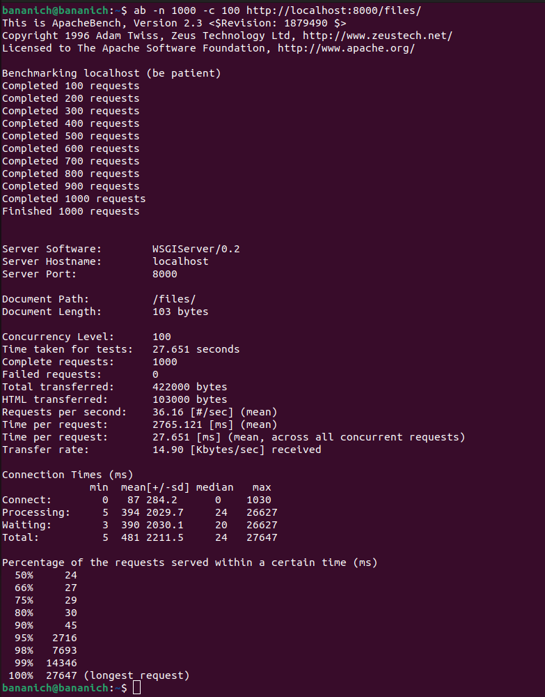

# Запуск проекта
## Docker
1. Склонировать репозиторий
2. Выполнить команду
```commandline
docker build -t djangoapp .
```
3. Выполнить команду
```commandline
docker run -d -p 8000:8000 djangoapp
```
## Или
1. Склонировать репозиторий
2. Перейти в директорию проекта
```commandline
cd django_file_upload_project
```
3. Активировать виртуальное окружение
```commandline
python3 -m venv venv
```
```commandline
source venv/bin/activate
```
4. Установить зависимости
```commandline
pip install -r requirements.txt
```
5. Перейти в директорию с проектом
```commandline
cd file_upload_project
```
6. Запустить redis и Сelery (в двух разных терминалах)
```commandline
redis-server
```
```commandline
python -m celery -A file_upload_project worker -l info
```
7. Запустить сервер
```commandline
python manage.py runserver
```
# Усложнения
## Тесты
Тесты описаны в [файле](file_upload_project/file_api/tests.py).
Чтобы запустить их, нужно:
1. Переместиться в директорию проекта
```commandline
cd file_upload_project
```
2. Выполнить команду
```commandline
python manage.py test
```
## Если ожидается большая нагрузка
1. Необходимо горизонтальное масштабирование (надо распределить нагрузку между несколькими серверами)
2. Кэшировать частые запросы (как к API, так и к БД)
3. Использовать микросервисную архитектура (разделить приложение на небольшие сервисы, каждый из которых отвечает за определенный функционал)
## RPS (запросы в секунду)
Используя Apache я отправил 1000 запросов с 100 одновременными соединениями, и узнал, что мой сервис выдерживает 36 запросов в секунду

